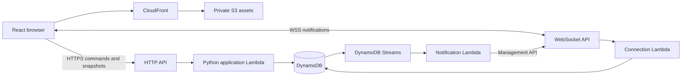

# Proposed architecture

Status: recommended baseline for review, 2026-09-12. No runtime is implemented.
See [ADR-0001](decisions/0001-stack.md) and [product assumptions](product.md).

## Stack

| Layer | Recommendation | Reason |
| --- | --- | --- |
| Browser | React + TypeScript + Vite SPA | Familiar ecosystem; static hosting fits a room-based app |
| Routes | React Router, declarative mode | Home and invitation/room URLs without a server framework |
| Server state | TanStack Query | One cache for HTTP room snapshots and mutation lifecycle |
| UI state | React component state and small context | Enough for dialogs, drafts, and connection status |
| Styling | Tailwind CSS v4 + selected shadcn/ui components | Consistent tokens and editable component source |
| Backend | Python Lambda handlers, Pydantic boundary models, boto3 adapters | Matches maintainer experience; small event-driven workload |
| HTTP | API Gateway HTTP API | Create, join, snapshot, and room commands |
| Realtime | API Gateway WebSocket API | Room-change notifications and connection lifecycle |
| Storage | DynamoDB on-demand + Streams | Durable room state, conditional writes, notification trigger |
| Hosting | Private S3 bucket behind CloudFront | Static frontend, no frontend application server |
| Infrastructure | AWS CDK v2 in Python | Same review language as backend |
| Tooling | npm + uv, committed lockfiles | Straightforward JS and Python dependency workflows |
| Tests | pytest, Vitest/Testing Library, Playwright, CDK assertions | Domain, UI, multi-browser, and infrastructure coverage |

Choose supported stable dependency releases during bootstrap, then commit exact
resolved lockfiles. Do not use floating `latest` in CI. Python 3.12 is the proposed
project baseline; select a supported Node LTS at bootstrap. CDK also needs Node
even when infrastructure is written in Python.

React recommends frameworks generally, but its documented Vite path is a
reasonable deliberate choice here: room pages need neither SEO rendering nor
React Server Components. Next.js would add a second server-side application
model without a clear MVP benefit. Revisit if a substantial public/content site
or server rendering becomes a requirement.

Tailwind handles styling, not component behavior. Start with shadcn/ui buttons,
dialogs, inputs, and alerts only as needed; retain their accessible primitives
and review keyboard behavior. Use CSS variables for colors/spacing and reusable
components for repeated patterns. Copied components become our maintenance
responsibility. MUI is a credible alternative if a strongly standardized Material
appearance is preferred; avoid mixing component systems.

## Request and update flow

One backend package, with separate HTTP, connection, and notification entry
points. Shared domain logic lives below those adapters. This is not a collection
of independently versioned microservices. Avoid a VPC/NAT, Redis, containers,
GraphQL, and workflow orchestration initially.

1. HTTP creates/joins a room and issues a scoped guest session credential.
2. The browser uses that credential to fetch its room snapshot and obtain a
   short-lived, single-use WebSocket ticket.
3. The connection handler atomically consumes the ticket, validates the session
   and room, and records the connection. Never put a reusable session token in a
   WebSocket URL. Redact tickets and credentials from all logs.
4. All game commands use authenticated HTTP. Successful writes increment the
   room revision and commit before the response indicates success.
5. A DynamoDB Streams consumer broadcasts only `room.updated` with room ID and
   revision to that room's active connections. Clients then fetch personalized,
   privacy-filtered snapshots. No estimates are carried in notifications.
6. The browser also refetches after successful connect, focus/reconnect, commands,
   and periodically while the room is active (initial target: every 30 seconds).
   Notifications improve latency; snapshots are the recovery mechanism.

Streams avoid the write-succeeds/broadcast-never-happens gap of direct fanout in
the HTTP handler. Delivery still needs retries, an on-failure destination, alarms,
and periodic snapshot recovery. Notifications may be duplicated or delayed.
Coalesce bursts of invalidations. Reject older snapshot revisions in the cache,
including late HTTP responses; clear room/session-specific caches on leave.

## Frontend state ownership

- **TanStack Query:** authoritative room snapshot keyed by room and participant
  identity (not the secret credential), participants, round, and estimates visible
  to that requester. HTTP responses and invalidations use this same cache.
- **React state:** input drafts, dialogs, a pending card selection, and socket
  status. Pending selection is distinct from a server-confirmed vote.
- **URL:** room/invitation identity. Never place host/session authority in it.
- **Guest credential:** session storage scoped to the tab for MVP refresh
  recovery; it is accessible to JavaScript, so maintain a restrictive CSP and
  avoid third-party scripts. An HttpOnly-cookie design is an alternative if the
  authentication requirements grow; it also requires deliberate CSRF handling.

Do not maintain a second room copy in Zustand/Redux/context. Add a client store
only when concrete shared local state warrants it. Socket management belongs in
one service/hook, with explicit cleanup and tests for React effect remounts.

## Data and concurrency

Start with a bounded room aggregate in a `Rooms` table: ID, invite credential hash,
host participant ID, participant map, current round ID/title/phase, private votes,
revision, and `expiresAt`. Private storage models never double as API responses.

An `Access` table holds hashed opaque session credentials, single-use ticket
records, connection records, and command receipts, with typed key prefixes and
expiry. Provide a room lookup index for fanout and direct connection-ID lookup
for disconnect cleanup. Session expiry cannot exceed room expiry. The detailed
keys and indexes are part of the contract/domain task, driven by these access
patterns rather than a generic database abstraction.

For each mutation, read current state consistently, validate membership and role,
apply a pure domain transition, and transactionally write with a condition on the
current revision alongside a command receipt. On contention, reread and retry a
bounded number of times. Validate the expected round ID and voting phase on each
attempt. Host phase transitions additionally supply their expected revision.
Never blindly replace a room after a stale read.

Scope command IDs to participant and room, store a request fingerprint and result,
and reject reuse with different input. Receipt retention covers the room lifetime.
This prevents a timeout/retry from creating two rounds. Handle room creation and
join idempotency too; define their scope explicitly in the contract task.

Cap participants at 20, item titles at 200 characters, names at 40 characters, and
bound payload sizes. Keep only the current round. This keeps the aggregate small;
measure serialized item size in tests. A busy large room or persistent history
would justify separate records; that is outside the current access pattern.

## Privacy and authorization

The room invitation grants permission to join, not host permission. Use
cryptographically random invitations and server-issued opaque sessions; store
credential hashes. Resolve actor identity from the credential, never from body
fields. Check expiration, room membership, and action permissions on every HTTP
command and ticket issuance. Session validity must also be checked during socket
operations/fanout; connection-time authentication is not permanent authority.

Before reveal, serializers expose `hasVoted` for others and `myVote` only to its
owner. After reveal, expose the permitted round votes. Host uses the same privacy
rule. Never include private database records in logs, exception messages, caches
shared between identities, or notification payloads. API snapshots are private
and must not be cached by a CDN.

## Reconnect, presence, and expiration

API Gateway connections have a two-hour maximum duration and a ten-minute idle
timeout. Use jittered reconnect and an application heartbeat, then resynchronize
over HTTP. Presence is approximate: track last-seen/lease expiry, support multiple
connections per participant, and never delete a participant's vote on disconnect.
`$disconnect` is best effort; prune dead connections on failed sends and lease
expiry as well. Notification payloads remain well below 32 KB.

DynamoDB TTL deletion is asynchronous. Explicit expiry checks enforce room and
session lifetime. Expired items remaining in storage never grant access. Do not
use a missing disconnect event or delayed TTL deletion as a correctness signal.

## Deployment and operations

Use one AWS region initially, with isolated dev and production resources. Make
account, region, allowed origins, domain, and expiry settings explicit CDK inputs;
do not invent real account IDs or deploy from default credentials accidentally.
Prefer short-lived CI AWS credentials through OIDC once the Git provider is known.

CloudFront serves a private S3 origin with origin access control, TLS, SPA route
fallback, short caching for the HTML entry point, and immutable hashed assets.
Keep API routes outside SPA fallback. Use scoped IAM permissions, bounded log
retention, request correlation IDs, and alarms for API failures, Lambda errors,
stream age/failures, and throttling. Add creation/join limits, connection limits,
and a budget alert before public exposure; a budget alert does not cap spending.

Costs follow connection-minutes, messages/fanout, HTTP reads, Lambda calls,
DynamoDB activity, assets, and logs. This workload avoids an always-running app
server, but estimate regional costs against an explicit usage scenario before
deployment. No fixed monthly price is asserted here. Cold starts and AWS-specific
realtime integration are the main tradeoffs.

Local development uses the Vite server and deterministic mock HTTP/event fixtures.
Domain tests run without AWS. Integration tests use an isolated AWS dev stack for
IAM, WebSockets, DynamoDB concurrency, and delivery behavior; mocks cannot prove
these work. An optional local Python adapter can reuse the application layer if
needed later. Do not require LocalStack before the first useful vertical slice.

## Alternatives considered

- **AppSync Events:** managed channel pub/sub reduces connection/fanout plumbing.
  It is a serious option if realtime operations outweigh keeping a familiar
  Python HTTP/Lambda design. It still needs persistence and game authorization.
  Recommendation here favors API Gateway's explicit model and established AWS
  examples, accepting ownership of connection cleanup and notification delivery.
- **AppSync GraphQL:** useful for a broader graph/schema-driven app; currently
  adds a query/resolver model for a small room snapshot and a few commands.
- **Container + WebSocket server:** simpler local persistent-connection model,
  but needs hosting capacity and shared state/fanout as instances scale.
- **HTTP polling alone:** simplest first integration; acceptable temporary slice,
  but less immediate and incurs repeated reads. Retain as recovery with WebSockets.
- **All TypeScript:** shares one language, but Python better matches the stated
  maintainer preference. Generate contract types to manage the language boundary.

## Sources

Recommendations above are project judgments. These primary sources establish the
underlying capabilities and constraints (checked 2026-09-12):

- [React's Vite path and framework tradeoffs](https://react.dev/learn/build-a-react-app-from-scratch)
- [Tailwind Vite integration](https://tailwindcss.com/docs/installation/using-vite)
- [shadcn/ui source ownership](https://ui.shadcn.com/docs)
- [TanStack Query cache updates](https://tanstack.com/query/latest/docs/framework/react/guides/updates-from-mutation-responses)
- [AWS WebSocket/Lambda/DynamoDB example](https://docs.aws.amazon.com/apigateway/latest/developerguide/websocket-api-chat-app.html)
- [WebSocket quotas](https://docs.aws.amazon.com/apigateway/latest/developerguide/apigateway-execution-service-websocket-limits-table.html)
- [Connection authorization and best-effort disconnect](https://docs.aws.amazon.com/apigateway/latest/developerguide/apigateway-websocket-api-route-keys-connect-disconnect.html)
- [DynamoDB TTL semantics](https://docs.aws.amazon.com/amazondynamodb/latest/developerguide/TTL.html)
- [CDK prerequisites](https://docs.aws.amazon.com/cdk/v2/guide/prerequisites.html)
- [AppSync Events](https://docs.aws.amazon.com/appsync/latest/eventapi/event-api-welcome.html)
